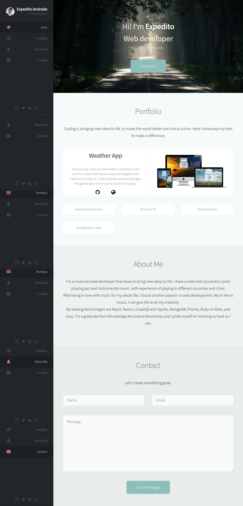

# Portfolio
This is the page I have built where I showcase all my projects, while also sharing my music videos and the articles I have written.

### Screenshots

#### Main Menu

- 

### FEATURES

It uses styled-components and Static Site Rendering.

### Live 

- [Here](https://www.expeditoandrade.me)

### BUILT WITH

- React / NextJs
- Styled Components

### Getting Started

- Clone the project to your local machine;
- `cd` into the project directory;
- Run `yarn install` to install the necessary modules;
- To check in development mode, run `yarn dev`, the page will automatically load on [localhost:3000](localhost:3000).

### AUTHORS

👤Expedito Andrade

- Github: [@githubexpjazz](https://github.com/expjazz)
- Twitter: [@expjazz](https://twitter.com/expeditoandrade13)
- Linkedin: [Expedito Andrade](https://www.linkedin.com/in/expedito-andrade/)
- Portfolio: [Expedito Andrade](https://www.expeditoandrade.me)

### Show your support

Give a star if you like this project!

### Acknowledgments

- Microverse
- This data is Fake. The idea is to showcase a possible dashoard

### 🤝 Contributing

Contributions, issues and feature requests are welcome! Start by:

- Forking the project
- Cloning the project to your local machine
- `cd` into the project directory
- Run `git checkout -b your-branch-name`
- Make your contributions
- Push your branch up to your forked repository
- Open a Pull Request with a detailed description to the development branch of the original project for a review

### Show your support

Give a ⭐️ if you like this project!

### 📝 License

This project is MIT licensed